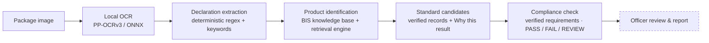

<div align="center">

# MetrIQ

### AI-Assisted Legal Metrology Inspection · Evidence-Backed BIS Assistant

**Point a photo of a product label at MetrIQ. It reads the declared values, works out the applicable Indian Standard, and shows its working — every value traced back to the pixel it came from.**


-111)


</div>

---

## The one rule

> **Retrieved BIS information is the source of truth — not the language model.**

MetrIQ never invents an Indian Standard number, a clause, a fee, a test, or a
compliance outcome. When the evidence is not strong enough, it says **`REVIEW`**
and shows nothing rather than guess. Every screen and every endpoint follows this.

---

## Two halves of one system

| | |
|---|---|
| **① The inspection pipeline** | An uploaded label image → local OCR → deterministic declaration extraction → product identification → verified Indian Standard candidates from the BIS knowledge base. |
| **② The BIS knowledge surfaces** | Natural-language Product → Standard discovery, certification guidance, recognised-lab directories, and hallmarking / HUID information — deterministic retrieval, with a local model that only *explains* what retrieval already found. |

---

## ① The inspection pipeline



Both endpoints take one package: a single photo (`image`, optional `side`) or several
photos of the same package (`images` with `sides` = FRONT / BACK / LEFT / RIGHT / TOP /
BOTTOM / UNKNOWN). Each photo is OCR'd separately and every value keeps the photo and
OCR region it came from; a photo that cannot be read is reported as failed, and sides
that were not photographed are reported as not uploaded — never as missing.
`POST /inspection/ocr` returns the OCR regions and declarations only.
Every compliance check explains itself deterministically — the exact rule condition, the
observed value, a reason code, the package evidence (photo → OCR region) and the verified
BIS requirement it comes from — and `completeness` lists each declaration as detected,
uncertain or not detected in the uploaded photos (never "legally missing").
`POST /inspection/analyze` (multipart, field `image`) runs everything through the
compliance check. A standard match is retrieval evidence, not a compliance or
certification decision. Compliance applies only requirements quoted from verified
knowledge records (`data/inspection_requirements.json`) with deterministic rules; when
requirements or package evidence are missing the result is `REVIEW`, never a guess.

### Escalation — officer review is the final step

```
image → OCR → declarations → product → BIS + Legal Metrology evidence → deterministic rules
      → SYSTEM RESULT (PASS / FAIL / REVIEW)
      → can the system confidently resolve this case?
            yes → final system result            (officer_status NOT_REQUIRED, never queued)
            no  → officer review queue → officer decision → final record
```

`app/escalation.py` decides this deterministically from the finished analysis — no model, and it
changes no result. Every inspection that cannot be resolved lists why, each reason with its
evidence system and the OCR regions / checks behind it: pipeline error, unreadable photos, low
image quality, product not identified, several plausible products or standards, product not
confirmed, no verified BIS standard, hallmark / HUID information (MetrIQ never verifies a HUID),
conflicting declarations (including across sides), uncertain OCR evidence, evidence not found,
requirements not checkable from an image, a Legal Metrology scope exclusion, and a REVIEW result.
Requirement areas that cannot be checked block a PASS (they could overturn it) but not a FAIL that
clear evidence established; every other reason always escalates. With today's verified data every
real inspection escalates — no standard has every requirement checkable — and that is shown, not
hidden.

### Officer review and inspection history

**Save for officer review** sends the same photos to `POST /inspections`: the backend runs
its own analysis and stores it in PostgreSQL with the photos, so a saved result can never
come from the browser. Every saved inspection keeps two things apart:

| | Written by | Changes later? |
|---|---|---|
| **System result** — BIS result, Legal Metrology result, combined `system_result`, reasons, full analysis (declarations, OCR regions, checks, evidence, sources) | the deterministic pipeline, once | never — a database trigger rejects any update |
| **Escalation** — `escalation_required`, `escalation_reasons` | the escalation assessment, once | never |
| **Officer review** — `officer_status`, `officer_decision`, `officer_result` (override only), `officer_note`, review timestamps | the officer | `NOT_REQUIRED` is final; otherwise once: `PENDING → IN_REVIEW → COMPLETED`, and a completed review is final |

Combined system result: FAIL if BIS or Legal Metrology FAILs, PASS only if both PASS, otherwise
REVIEW. REVIEW is expected and not hidden: a label can pass every checkable Legal Metrology rule
while other requirement areas cannot be established from a photo — that is what the officer
review is for. Decisions: **Accept** the system result, **Override** it (with the officer's result
and a required note), or **Manual review** (note required).

- **Review** (`/review`) — only escalated inspections (PENDING or IN_REVIEW), with why each was escalated.
- **History** (`/history`) — every saved inspection: date, product, BIS standard, system result,
  officer status, final decision. `/history/:id` reopens it with the stored photos, OCR boxes,
  declarations, BIS and Legal Metrology checks, evidence and the review panel.
- **Report** — "View report" on a saved inspection opens a PDF built from the stored record (ReportLab,
  bundled Noto Sans fonts): summary, stored photos with OCR boxes, OCR evidence, declarations with their
  stored statuses, BIS standard evidence (or an explicit "no verified standard"), Legal Metrology
  requirements (checkable vs not checkable), compliance results from the deterministic rules, the
  automated system result with escalation reasons, officer review, a final outcome that keeps the system
  result and the officer's decision side by side, and only the sources stored with the evidence. No officer
  identity is shown (there are no officer accounts).
- **Dashboard** — counts from the database, with system results (PASS / FAIL / REVIEW) and officer
  review states (pending / in review / completed) shown separately.

| Endpoint | |
|---|---|
| `POST /inspections` | multipart photos (`image` or `images` + `sides`); other fields → 422 |
| `GET /inspections` | newest first; `?officer_status=PENDING&officer_status=IN_REVIEW` |
| `GET /inspections/stats` | database counts |
| `GET /inspections/{id}` · `GET /inspections/{id}/images/{index}` | saved record · stored photo |
| `GET /inspections/{id}/report.pdf` | evidence-backed PDF report of the saved record — read-only, nothing recomputed, no model |
| `POST /inspections/{id}/review` | `{"action":"START"}` or `{"action":"COMPLETE","decision":…,"officer_result":…,"note":…}`; unknown fields (e.g. `system_result`) → 422, wrong state or not escalated → 409, unknown id → 404, database down → 503 |

### What the officer sees

<table>
<tr>
<td width="50%"><b>Declared fields</b><br/>Each of the 14 legal-metrology fields, with the exact OCR region, bounding box, OCR confidence and extraction method behind it. Click a field → its box lights up on the image.</td>
<td width="50%"><b>Applicable Indian Standard</b><br/>The matched standard, its title, the official BIS source, a real match score, and a plain "why this match" — or an honest <code>REVIEW</code> state.</td>
</tr>
<tr>
<td></td>
<td></td>
</tr>
</table>


### Evidence traceability

```
IMAGE → OCR REGION → DECLARATION → PRODUCT CLUE → PRODUCT     → STANDARD CANDIDATE → BIS SOURCE
       (id, bbox,    (field, value, (text + its   (KB product   (IS 18140:2023,       (verified
        confidence)   status)        OCR regions)  description)  why this result)      record)
```

Products and standards come only from `data/knowledge/` through the same
deterministic retrieval engine as Product → Standard. A result counts as a product
match only when the label text contains a product phrase of that record; an IS
number printed on the label is one more signal, checked against the knowledge
base — never proof on its own. Anything weaker is `REVIEW`, with the reason.

### Try it

Sample label images live in [`samples/ocr-labels/`](samples/ocr-labels/):

| Image | Identified as | → Standard candidate |
|---|---|---|
| `synth_clean-declaration.png` | Roasted Bengal Gram | **IS 18140:2023** |
| `synth_led-lamp.png` | Self-ballasted LED lamps | **IS 16102 (Part 1)** |
| `synth_electric-kettle.png` | Electric Kettles and Jugs | **IS 367:1993** |
| `synth_low-light-blurry.jpg` | (same, quality flagged low) | still matched |
| `real_*` (Wikimedia Commons) | real-world label photos, incl. hard cases | OCR stress tests |

```bash
# one photo; for several sides use: -F images=@front.jpg -F sides=FRONT -F images=@back.jpg -F sides=BACK
curl -s -F "image=@samples/ocr-labels/synth_led-lamp.png" \
  http://127.0.0.1:8000/inspection/analyze | jq '.product, [.standards[].standard_number]'
```

---

## ② BIS knowledge surfaces

Describe a product in plain words; deterministic retrieval returns candidate
Indian Standards **only when the retrieved BIS evidence actually describes that
product**, each with a "Why this result?" built from real matching signals.

<table>
<tr>
<td width="50%"></td>
<td width="50%"></td>
</tr>
</table>

| Endpoint | What it does | Local model? |
|---|---|---|
| `GET /health` | liveness | — |
| `GET`/`POST /search` | deterministic lexical retrieval over the BIS knowledge base | no |
| `POST /product-standard` | Product → candidate Indian Standard + deterministic "Why this result?" | no |
| `POST /inspection/analyze` | image → OCR → declarations → product → verified Indian Standard | only if rules miss |
| `POST /ask` | grounded BIS Q&A (Hallmarking / HUID screen) | yes |
| `POST /certification-guidance` | grounded BIS certification guidance | yes |
| `POST /laboratory-search` | BIS recognised-lab directories (`explain=false` skips the model) | optional |

The grounded endpoints call a **local** [LM Studio](https://lmstudio.ai) server.
If it is offline, the deterministic endpoints keep working fully and the grounded
ones return a clear `503` — never a fabricated answer.

---

## Architecture

```
backend/                      Python 3.14 · FastAPI
  app/
    ocr.py                    local OCR wrapper (rapidocr-onnxruntime, PP-OCRv3 weights)
    inspection.py             InspectionAnalyzer + response models
    inspection_api.py         POST /inspection/ocr, POST /inspection/analyze
    declarations.py           deterministic declarations (DETECTED / UNCERTAIN / NOT_DETECTED)
    product_identification.py product + standard candidates over the knowledge base
    requirements.py           verified inspection requirements: load, validate, coverage
    compliance.py             deterministic compliance engine (PASS / FAIL / REVIEW) + generic declaration rules
    package_label.py          Legal Metrology package-label requirements (separate result from BIS)
    pipeline.py               OCR → declarations → product → standards → BIS compliance + package label
    db.py, records.py         PostgreSQL session; saved inspections + officer review (SQLAlchemy)
    records_api.py            /inspections: save, list, stats, detail, stored photos, review
  migrations/                 Alembic schema migrations (alembic.ini in backend/)
    retrieval/                deterministic lexical search (text.py, engine.py)
    rag.py                    grounded Q&A (/ask)
    product.py                Product → Standard + "Why this result?"
    certification.py, laboratory.py
    llm.py                    local LM Studio adapter (OpenAI-compatible)
    api.py / main.py          router / app
  tests/                      plain-Python runners, bridged to pytest
data/
  knowledge/                  knowledge base — one JSON file per category (BIS; legal_metrology.json holds
                              official Legal Metrology texts, source_authority LEGAL_METROLOGY)
  inspection_requirements.json requirements quoted word for word from verified knowledge records
samples/ocr-labels/           sample label images for the inspection pipeline
frontend/                     React 19 · TypeScript · Vite · Tailwind v4
```

**Everything runs locally and free.** No OpenAI / Claude / cloud LLM, no paid OCR,
no paid database (a local PostgreSQL stores saved inspections). OCR uses the PaddleOCR **PP-OCRv3** weights through ONNX Runtime
(`rapidocr-onnxruntime`) because PaddlePaddle publishes no wheels for Python 3.14;
the models ship in the wheel, so inference is fully offline.

---

## Quickstart

### Backend — Python 3.11+

```bash
cd backend
python3 -m venv .venv
source .venv/bin/activate
pip install -r requirements.txt          # first OCR call also loads the ONNX models (~13 MB, bundled)

uvicorn app.main:app --reload            # http://127.0.0.1:8000
```

### Inspection database — PostgreSQL

Saved inspections and officer reviews need a local PostgreSQL (everything else runs without it;
the `/inspections` endpoints return 503 until it is available). On Arch Linux:

```bash
sudo pacman -S --needed postgresql
sudo -iu postgres initdb -D /var/lib/postgres/data
sudo systemctl enable --now postgresql
sudo -iu postgres createuser -s "$USER"
createdb metriq && createdb metriq_test          # app database + test database

cd backend
./.venv/bin/alembic upgrade head                 # create the schema (DATABASE_URL, default postgresql+psycopg:///metriq)
```

- Health: <http://127.0.0.1:8000/health>
- API docs: <http://127.0.0.1:8000/docs>

### Frontend

```bash
cd frontend
npm install
npm run dev                              # http://localhost:5173  (proxies /api → :8000)
```

### Local model (for the grounded endpoints)

Load a small instruction model in [LM Studio](https://lmstudio.ai) (default
`qwen/qwen3-4b`) and start its server on port `1234`. On a laptop, load it with
`--parallel 1`. Override with env vars if needed:

```bash
export LM_STUDIO_BASE_URL=http://127.0.0.1:1234/v1   # default (LLM_BASE_URL also works)
export LM_STUDIO_MODEL=qwen/qwen3-4b                  # default (LLM_MODEL also works)
```

> **Demoing tip.** The fastest, model-free paths are **Product → Standard** and an
> inspection of a known product (deterministic identification, ~3 s). When the
> label names nothing in the knowledge base, the local model is asked for a search
> term (never a verdict), which can take ~25 s on first call.

---

## Tests

```bash
cd backend
./.venv/bin/python -m pytest -q                 # all suites (needs the metriq_test database)
./.venv/bin/python scripts/check_knowledge.py   # knowledge-base validation

cd ../frontend
npx tsc -b --noEmit                             # type check
npm run build                                   # production build
```

Backend suites are plain-Python runners (each exits non-zero on failure);
`tests/test_plain_runners.py` runs them all under pytest, so `pytest -q` is an
authoritative gate. Model-dependent tests use a stub — no LM Studio needed.

---

## Roadmap

Phases 1–14 are complete (see [`CLAUDE.md`](CLAUDE.md) for the full log). What remains:

- [x] **Compliance engine** — deterministic PASS / FAIL / REVIEW over verified requirements (currently 2 of 36 standards have checkable requirements; everything else is `STANDARD_ONLY` → REVIEW)
- [x] **Legal Metrology package-label requirements** — 11 requirements from the Legal Metrology (Packaged Commodities) Rules, 2011 and amendments (official Department of Consumer Affairs PDFs); 6 are checked deterministically (MRP, net quantity, manufacturer name + address, commodity name, month and year of manufacture, consumer-care phone + e-mail), 5 cannot be checked from a photo. Reported separately from BIS compliance.
- [ ] **Requirement coverage** — more verified BIS requirements (still 1 checkable BIS rule)
- [x] **Officer review & inspection history** — saved inspections in PostgreSQL, immutable system result, officer accept / override / manual review with notes, real History, Review queue and Dashboard
- [x] **Escalation** — deterministic resolve-or-escalate decision with evidence-linked reasons; officer review only for cases the system cannot resolve
- [x] **Inspection report** — evidence-backed PDF audit trail of any saved inspection

---

## Reference — retrieval scoring

Each query term is matched against a record's fields and the weights are summed
(configurable in `app/retrieval/engine.py`): standard-number match `8` (`12` if the
year also matches), title `4`, keyword `3`, category hint `2`, document name `1.5`,
reference `1`, buried content mention `1`.

**Confidence** of the top hit, from its total score: `high` ≥ 7.5, `medium` ≥ 4.0,
`low` ≥ 1.0, else `none`. If the top hit covers less than ~⅓ of the query terms the
confidence is capped at `low`. When nothing matches: `confidence: "none"`,
`abstained: true`, empty `results` — the system never invents a result.

**Inspection product identification** ([`app/product_identification.py`](backend/app/product_identification.py)):
retrieval results are kept only when the label contains a multi-word product
phrase of the record, so a single generic word ("water", "gram") can never pull in
a standard. Phrases shared by several standards are category-level; keyword
aliases need corroboration; otherwise → `REVIEW`.
