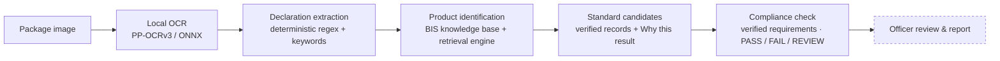

<div align="center">

# MetrIQ

### AI-Assisted Legal Metrology Inspection · Evidence-Backed BIS Assistant

**Point a photo of a product label at MetrIQ. It reads the declared values, works out the applicable Indian Standard, and shows its working — every value traced back to the pixel it came from.**


-111)


</div>

---

## The one rule

> **Retrieved BIS information is the source of truth — not the language model.**

MetrIQ never invents an Indian Standard number, a clause, a fee, a test, or a
compliance outcome. When the evidence is not strong enough, it says **`REVIEW`**
and shows nothing rather than guess. Every screen and every endpoint follows this.

---

## Two halves of one system

| | |
|---|---|
| **① The inspection pipeline** | An uploaded label image → local OCR → deterministic declaration extraction → product identification → verified Indian Standard candidates from the BIS knowledge base. |
| **② The BIS knowledge surfaces** | Natural-language Product → Standard discovery, certification guidance, recognised-lab directories, and hallmarking / HUID information — deterministic retrieval, with a local model that only *explains* what retrieval already found. |

---

## ① The inspection pipeline



Both endpoints take one package: a single photo (`image`, optional `side`) or several
photos of the same package (`images` with `sides` = FRONT / BACK / LEFT / RIGHT / TOP /
BOTTOM / UNKNOWN). Each photo is OCR'd separately and every value keeps the photo and
OCR region it came from; a photo that cannot be read is reported as failed, and sides
that were not photographed are reported as not uploaded — never as missing.
`POST /inspection/ocr` returns the OCR regions and declarations only.
Every compliance check explains itself deterministically — the exact rule condition, the
observed value, a reason code, the package evidence (photo → OCR region) and the verified
BIS requirement it comes from — and `completeness` lists each declaration as detected,
uncertain or not detected in the uploaded photos (never "legally missing").
`POST /inspection/analyze` (multipart, field `image`) runs everything through the
compliance check. A standard match is retrieval evidence, not a compliance or
certification decision. Compliance applies only requirements quoted from verified
knowledge records (`data/inspection_requirements.json`) with deterministic rules; when
requirements or package evidence are missing the result is `REVIEW`, never a guess.

### Escalation — officer review is the final step

```
image → OCR → declarations → product → BIS + Legal Metrology evidence → deterministic rules
      → SYSTEM RESULT (PASS / FAIL / REVIEW)
      → can the system confidently resolve this case?
            yes → final system result            (officer_status NOT_REQUIRED, never queued)
            no  → officer review queue → officer decision → final record
```

`app/escalation.py` decides this deterministically from the finished analysis — no model, and it
changes no result. Every inspection that cannot be resolved lists why, each reason with its
evidence system and the OCR regions / checks behind it: pipeline error, unreadable photos, low
image quality, product not identified, several plausible products or standards, product not
confirmed, no verified BIS standard, hallmark / HUID information (MetrIQ never verifies a HUID),
conflicting declarations (including across sides), uncertain OCR evidence, evidence not found,
requirements not checkable from an image, a Legal Metrology scope exclusion, and a REVIEW result.
Requirement areas that cannot be checked block a PASS (they could overturn it) but not a FAIL that
clear evidence established; every other reason always escalates. With today's verified data every
real inspection escalates — no standard has every requirement checkable — and that is shown, not
hidden.

### Hallmark / HUID evidence — observed, never authenticated

The Hallmarking page can inspect a hallmark photo (a **hallmark inspection**): OCR → hallmark evidence
(`app/hallmark.py`) → escalation → officer review → report. MetrIQ extracts a *potential* HUID (a labelled
six-character alphanumeric code), the purity / fineness mark and any "BIS" text, each linked to its OCR region,
and runs only checks the verified BIS Hallmarking FAQ supports: a HUID is readable (observed, not verified),
the purity mark is a permitted grade (IS 1417 gold / IS 2112 silver), the BIS logo (not supported — a graphic),
and HUID authenticity (not supported — external authoritative verification required, e.g. BIS Care App).
`verification_status` is `NOT_VERIFIED` or `NOT_DETECTED`; there is no VERIFIED state, no check can FAIL, and
the hallmark result is always REVIEW, so hallmark inspections go to an officer. Low-confidence, multiple or
unlabelled HUID candidates are never selected. Printed text such as "HUID VERIFIED" is recorded as an
untrusted claim and changes nothing. Legal Metrology package-label rules are not applied to a hallmark
inspection. An optional HUID reference field only compares text with what OCR read.

### Officer review and inspection history

**Save for officer review** sends the same photos to `POST /inspections`: the backend runs
its own analysis and stores it in PostgreSQL with the photos, so a saved result can never
come from the browser. Every saved inspection keeps two things apart:

| | Written by | Changes later? |
|---|---|---|
| **System result** — BIS result, Legal Metrology result, combined `system_result`, reasons, full analysis (declarations, OCR regions, checks, evidence, sources) | the deterministic pipeline, once | never — a database trigger rejects any update |
| **Escalation** — `escalation_required`, `escalation_reasons` | the escalation assessment, once | never |
| **Officer review** — `officer_status`, `officer_decision`, `officer_result` (override only), `officer_note`, review timestamps | the officer | `NOT_REQUIRED` is final; otherwise once: `PENDING → IN_REVIEW → COMPLETED`, and a completed review is final |

Combined system result: FAIL if BIS or Legal Metrology FAILs, PASS only if both PASS, otherwise
REVIEW. REVIEW is expected and not hidden: a label can pass every checkable Legal Metrology rule
while other requirement areas cannot be established from a photo — that is what the officer
review is for. Decisions: **Accept** the system result, **Override** it (with the officer's result
and a required note), or **Manual review** (note required).

- **Review** (`/review`) — only escalated inspections (PENDING or IN_REVIEW), with why each was escalated.
- **History** (`/history`) — every saved inspection: date, product, BIS standard, system result,
  officer status, final decision. `/history/:id` reopens it with the stored photos, OCR boxes,
  declarations, BIS and Legal Metrology checks, evidence and the review panel.
- **Report** — "View report" on a saved inspection opens a PDF built from the stored record (ReportLab,
  bundled Noto Sans fonts): summary, stored photos with OCR boxes, OCR evidence, declarations with their
  stored statuses, BIS standard evidence (or an explicit "no verified standard"), Legal Metrology
  requirements (checkable vs not checkable), compliance results from the deterministic rules, the
  automated system result with escalation reasons, officer review, a final outcome that keeps the system
  result and the officer's decision side by side, and only the sources stored with the evidence. No officer
  identity is shown (there are no officer accounts).
- **Dashboard** — counts from the database, with system results (PASS / FAIL / REVIEW) and officer
  review states (pending / in review / completed) shown separately.

| Endpoint | |
|---|---|
| `POST /inspections` | multipart photos (`image` or `images` + `sides`), optional `inspection_type` `PACKAGE` / `HALLMARK`; other fields → 422 |
| `GET /inspections` | newest first; `?officer_status=PENDING&officer_status=IN_REVIEW` |
| `GET /inspections/stats` | database counts |
| `GET /inspections/{id}` · `GET /inspections/{id}/images/{index}` | saved record · stored photo |
| `GET /inspections/{id}/report.pdf` | evidence-backed PDF report of the saved record — read-only, nothing recomputed, no model |
| `POST /inspections/{id}/review` | `{"action":"START"}` or `{"action":"COMPLETE","decision":…,"officer_result":…,"note":…}`; unknown fields (e.g. `system_result`) → 422, wrong state or not escalated → 409, unknown id → 404, database down → 503 |

### What the officer sees

<table>
<tr>
<td width="50%"><b>Declared fields</b><br/>Each of the 14 legal-metrology fields, with the exact OCR region, bounding box, OCR confidence and extraction method behind it. Click a field → its box lights up on the image.</td>
<td width="50%"><b>Applicable Indian Standard</b><br/>The matched standard, its title, the official BIS source, a real match score, and a plain "why this match" — or an honest <code>REVIEW</code> state.</td>
</tr>
<tr>
<td></td>
<td></td>
</tr>
</table>


### Evidence traceability

```
IMAGE → OCR REGION → DECLARATION → PRODUCT CLUE → PRODUCT     → STANDARD CANDIDATE → BIS SOURCE
       (id, bbox,    (field, value, (text + its   (KB product   (IS 18140:2023,       (verified
        confidence)   status)        OCR regions)  description)  why this result)      record)
```

Products and standards come only from `data/knowledge/` through the same
deterministic retrieval engine as Product → Standard. A result counts as a product
match only when the label text contains a product phrase of that record; an IS
number printed on the label is one more signal, checked against the knowledge
base — never proof on its own. Anything weaker is `REVIEW`, with the reason.

### Try it

Sample label images live in [`samples/ocr-labels/`](samples/ocr-labels/):

| Image | Identified as | → Standard candidate |
|---|---|---|
| `synth_clean-declaration.png` | Roasted Bengal Gram | **IS 18140:2023** |
| `synth_led-lamp.png` | Self-ballasted LED lamps | **IS 16102 (Part 1)** |
| `synth_electric-kettle.png` | Electric Kettles and Jugs | **IS 367:1993** |
| `synth_low-light-blurry.jpg` | (same, quality flagged low) | still matched |
| `real_*` (Wikimedia Commons) | real-world label photos, incl. hard cases | OCR stress tests |

```bash
# one photo; for several sides use: -F images=@front.jpg -F sides=FRONT -F images=@back.jpg -F sides=BACK
curl -s -F "image=@samples/ocr-labels/synth_led-lamp.png" \
  http://127.0.0.1:8000/inspection/analyze | jq '.product, [.standards[].standard_number]'
```

---

## ② BIS knowledge surfaces

Describe a product in plain words; deterministic retrieval returns candidate
Indian Standards **only when the retrieved BIS evidence actually describes that
product**, each with a "Why this result?" built from real matching signals.

<table>
<tr>
<td width="50%"></td>
<td width="50%"></td>
</tr>
</table>

| Endpoint | What it does | Local model? |
|---|---|---|
| `GET /health` | liveness | — |
| `GET`/`POST /search` | deterministic lexical retrieval over the BIS knowledge base | no |
| `POST /product-standard` | Product → candidate Indian Standard + deterministic "Why this result?" | no |
| `POST /inspection/analyze` | image → OCR → declarations → product → verified Indian Standard | only if rules miss |
| `POST /ask` | grounded BIS Q&A, in English / Hindi / Telugu | yes |
| `POST /certification-guidance` | certification journey (deterministic) + grounded explanation (`explain=false` skips the model) | optional |
| `POST /laboratory-search` | testing laboratories for a standard or product (`explain=false` skips the model) | optional |

### Hallmarking & HUID

**MetrIQ can identify and explain observable hallmark/HUID evidence, but it does
not authenticate a physical jewellery item's hallmark, HUID, jeweller
registration, or AHC status.**

There is deliberately **no AUTHENTIC, VERIFIED or CERTIFIED state** for a
physical item anywhere in the code. `verification_status` is only
`NOT_VERIFIED` or `NOT_DETECTED`, the hallmark result is always `REVIEW`, and
`official_verification_required` is always true — MetrIQ has no channel that
could establish authenticity. An image is not proof; OCR is not proof; the
vision model is not proof; an LLM is not proof.

```
photo -> OCR -----+
                  +-- evidence fusion -> observable evidence -> REVIEW
        vision ---+      (a conflict is stated, never resolved)
```

| Reported | Meaning |
|---|---|
| `outcome` | `OBSERVATIONS_FOUND` / `NO_OBSERVATIONS` / `UNCERTAIN` — what the photo showed |
| `components` | The three marks BIS enumerates — BIS logo, purity/fineness, HUID — each `DETECTED` / `NOT_DETECTED` / `UNCERTAIN` / `NOT_SUPPORTED`, with a deterministic reason |
| `vision` | The existing Milestone 15 observation, reused. It can only say whether the photo *looks like* a precious-metal article — it never reads a mark. Disagreement with OCR is a stated **conflict**; MetrIQ picks neither. |
| `user_huid` | A HUID the user typed: preserved verbatim, labelled `USER_PROVIDED`, compared with the OCR text as a **string**. A match changes nothing. |
| `official_verification` | Quoted from verified BIS records (BIS Care App). `performed_by_metriq` is always false. When the knowledge base states no mechanism, nothing is invented. |

The BIS logo is always `NOT_SUPPORTED`: it is a graphic mark and OCR reads text,
so reading the letters "BIS" is not the logo. **"Not detected" is about the
photograph** — never a finding that the article lacks the mark. Text printed on
the item claiming "VERIFIED" or "AUTHENTIC" is recorded as an untrusted claim
and changes no status.

Not built, and deliberately out of scope: the jeweller registration journey and
the Assaying & Hallmarking Centre workflow. Hallmarking and package inspection
stay separate — a hallmark inspection reports Legal Metrology as `NOT_APPLIED`.

Multilingual (Milestone 17) applies: hallmarking questions work in English,
Hindi and Telugu, and the evidence stays canonical.

### Testing laboratories

**MetrIQ identifies laboratories from verified laboratory evidence. It does not
independently establish a laboratory's current accreditation, scope,
availability, or operational status.**

`POST /laboratory-search` finds laboratories three ways — by `standard_number`,
by a question naming a standard, or by a product, which reuses the existing
`ProductStandardFinder`:

```
"Where can I test an electric kettle?"
   -> ProductStandardFinder  ->  IS 367:1993
   -> laboratories BIS's own LIMS listing records against IS 367:1993
```

A laboratory is relevant to a standard **only because BIS itself lists it
there**. Relevance is never inferred from a laboratory's name, its city, or the
fact that it is a testing laboratory — those are separate, clearly-labelled
search signals, never a capability claim. If the product → standard step is not
confident, no standard is claimed and no laboratories are returned.

Every result carries a deterministic **why**: `STANDARD_LISTED`,
`PRODUCT_LISTED`, `NAME_MATCH` or `CITY_MATCH` — only the signals that actually
occurred. Results are ordered **alphabetically, not ranked**: MetrIQ has no
evidence that would justify calling one listed laboratory better, recommended or
most suitable, so it does not.

**The data** is a dated snapshot of BIS's own Laboratory Information Management
System ("IS-wise test facilities in BIS / recognised / empanelled laboratories",
`lims.bis.gov.in`), ingested by `backend/scripts/fetch_lims_laboratories.py`
into `data/laboratories.json`. The application never calls LIMS at runtime.

| | |
|---|---|
| Coverage | 1,205 records · 245 laboratories · 157 standards as listed · 83 cities. 78 of the 97 verified knowledge-base standards have at least one listed laboratory. |
| Fields | Name, OSL code, city, standard as listed, product as listed, grade/type, recognition validity date, BIS remark — each only when the record holds it. A missing field reads "Not available in the verified MetrIQ record." |
| Not held | Addresses, phone numbers, emails, accreditation numbers, NABL status, test scope beyond what LIMS prints. MetrIQ never supplies these. |
| Currentness | Validity is reported as `VALID_AT_SNAPSHOT` / `EXPIRED_AT_SNAPSHOT` / `NOT_STATED` — never "currently valid". Confirm current scope, availability and contact details with the laboratory before arranging testing. |
| Editions | A different edition is a different standard. BIS lists IS 14543 (2016) and IS 14543 (2024) separately, so their laboratories are never merged — the other edition is reported instead of silently dropped. |
| No match | "No matching verified laboratory record was found" is a statement about MetrIQ's coverage, **not** about which laboratories exist. |

The optional model explanation receives only the retrieved records and may name
a laboratory **only** if it is in them. Retrieval happens before the model is
called; the model never decides which laboratories are relevant.

Laboratory discovery is **informational**. A saved inspection shows the
laboratories listed for its identified standard, and the PDF report has a
"Relevant testing laboratories" section — neither affects PASS / FAIL / REVIEW,
and neither implies any laboratory tested the item.

Multilingual (Milestone 17) works unchanged: Hindi and Telugu laboratory
questions reach the same standard and the same laboratories as the English one.

### Multilingual assistant (English · Hindi · Telugu)

**MetrIQ's multilingual assistant changes the language of interaction, not the
source of truth.** The knowledge base stays canonical English. It is never
translated, never copied, never re-indexed — there is no second knowledge base
and no translation service.

```
user query (any language)
   -> deterministic script detection        (no model, no network)
   -> known product / BIS terms rewritten to canonical English
   -> the EXISTING deterministic SearchEngine, unchanged
   -> the SAME verified BIS records
   -> grounded answer, written in the user's language
```

`/ask`, `/certification-guidance` and `/laboratory-search` accept a `language`
of `auto` (default), `en`, `hi` or `te`, and report the language they answered
in. **A request without the field behaves exactly as it did before** — for
English the system prompt is byte-for-byte unchanged.

| | |
|---|---|
| Detection | Unicode script ranges (Devanagari, Telugu). A real run of an Indian script wins; a stray character does not. Never an LLM. |
| Explicit choice | Always beats detection. An unknown code falls back to detection rather than erroring. |
| Aliases | A small table (`app/language.py`) mapping Hindi/Telugu spellings of products and BIS terms **that exist in the verified knowledge base** to their canonical English. Not a dictionary, not a transliteration engine. |
| Mixed language | Hinglish / Tanglish work: English product names already survive retrieval, and romanized question words are dropped so they stop diluting the match. |
| Evidence | Identical in every language — same records, same standard numbers, same record ids, same source URLs, same stored English text. |

The rewrite exists because `retrieval/text.normalize` is ASCII-only, so a pure
Hindi or Telugu query would otherwise reach retrieval as an empty string. The
layer sits *before* retrieval; the engine, its scoring and the records are
untouched.

The model is told to write in the chosen language while reproducing Indian
Standard numbers, scheme names, rule ids, document names and source URLs
**exactly as stored, never translated**. It may gloss a document title in the
user's language beside the original, never instead of it.

**Limits carry across languages unchanged.** If retrieval finds nothing, the
assistant abstains in the user's language — it never invents a standard to fill
the gap. Certification journeys, compliance results, OCR text and declarations
stay canonical: OCR output is raw evidence and is never translated, and product
identification, the vision path and the inspection pipeline are untouched by
this layer.

Not covered: the application UI itself is English, and languages beyond these
three are answered in English.

### Certification journey

`POST /certification-guidance` answers *"what certification process do I follow?"*
Send a question, a product, or a `standard_number`; add `"explain": false` for the
deterministic journey alone. The `journey` in the response carries the identified
product and standard, the BIS scheme, the numbered steps, next steps, evidence,
official sources, a verification status and its limitations.

Nothing in it is written by MetrIQ. Each step's text is a **word-for-word quote**
from a verified knowledge record with that record's official BIS URL, and the
scheme itself is read out of verified text two independent ways — the BIS
"Products under Compulsory Certification" listing the standard record was
transcribed from, and any certification record that names that standard number.
If they disagree the conflict is shown and MetrIQ picks neither. If neither says
anything, the status is `INSUFFICIENT` rather than a guess.

| Status | Meaning |
|---|---|
| `VERIFIED` | one standard identified, a route established, every documented step present |
| `PARTIAL` | several candidate standards, a conflict, missing steps, or hallmarking |
| `INSUFFICIENT` | no verified record states a route for this standard |

It is **guidance about the route for a product type** — never a statement that a
product, manufacturer or licence is certified, and never a legal determination.
MetrIQ states no fee amount, processing time, required document or testing
requirement: those live only in the BIS documents it links to.

The grounded endpoints call a **local** [LM Studio](https://lmstudio.ai) server.
If it is offline, the deterministic endpoints keep working fully and the grounded
ones return a clear `503` — never a fabricated answer.

---

## Architecture

```
backend/                      Python 3.14 · FastAPI
  app/
    ocr.py                    local OCR wrapper (rapidocr-onnxruntime, PP-OCRv3 weights)
    inspection.py             InspectionAnalyzer + response models
    inspection_api.py         POST /inspection/ocr, POST /inspection/analyze
    declarations.py           deterministic declarations (DETECTED / UNCERTAIN / NOT_DETECTED)
    product_identification.py product + standard candidates over the knowledge base
    requirements.py           verified inspection requirements: load, validate, coverage
    compliance.py             deterministic compliance engine (PASS / FAIL / REVIEW) + generic declaration rules
    package_label.py          Legal Metrology package-label requirements (separate result from BIS)
    pipeline.py               OCR → declarations → product → standards → BIS compliance + package label
    db.py, records.py         PostgreSQL session; saved inspections + officer review (SQLAlchemy)
    records_api.py            /inspections: save, list, stats, detail, stored photos, review
  migrations/                 Alembic schema migrations (alembic.ini in backend/)
    retrieval/                deterministic lexical search (text.py, engine.py)
    rag.py                    grounded Q&A (/ask)
    product.py                Product → Standard + "Why this result?"
    certification.py, laboratory.py
    llm.py                    local LM Studio adapter (OpenAI-compatible)
    api.py / main.py          router / app
  tests/                      plain-Python runners, bridged to pytest
data/
  knowledge/                  knowledge base — one JSON file per category (BIS; legal_metrology.json holds
                              official Legal Metrology texts, source_authority LEGAL_METROLOGY)
  inspection_requirements.json requirements quoted word for word from verified knowledge records
samples/ocr-labels/           sample label images for the inspection pipeline
frontend/                     React 19 · TypeScript · Vite · Tailwind v4
```

**Everything runs locally and free.** No OpenAI / Claude / cloud LLM, no paid OCR,
no paid database (a local PostgreSQL stores saved inspections). OCR uses the PaddleOCR **PP-OCRv3** weights through ONNX Runtime
(`rapidocr-onnxruntime`) because PaddlePaddle publishes no wheels for Python 3.14;
the models ship in the wheel, so inference is fully offline.

---

## Quickstart

### Backend — Python 3.11+

```bash
cd backend
python3 -m venv .venv
source .venv/bin/activate
pip install -r requirements.txt          # first OCR call also loads the ONNX models (~13 MB, bundled)

uvicorn app.main:app --reload            # http://127.0.0.1:8000
```

### Inspection database — PostgreSQL

Saved inspections and officer reviews need a local PostgreSQL (everything else runs without it;
the `/inspections` endpoints return 503 until it is available). On Arch Linux:

```bash
sudo pacman -S --needed postgresql
sudo -iu postgres initdb -D /var/lib/postgres/data
sudo systemctl enable --now postgresql
sudo -iu postgres createuser -s "$USER"
createdb metriq && createdb metriq_test          # app database + test database

cd backend
./.venv/bin/alembic upgrade head                 # create the schema (DATABASE_URL, default postgresql+psycopg:///metriq)
```

- Health: <http://127.0.0.1:8000/health>
- API docs: <http://127.0.0.1:8000/docs>

### Frontend

```bash
cd frontend
npm install
npm run dev                              # http://localhost:5173  (proxies /api → :8000)
```

### Local model (for the grounded endpoints)

Load a small instruction model in [LM Studio](https://lmstudio.ai) (default
`qwen/qwen3-4b`) and start its server on port `1234`. On a laptop, load it with
`--parallel 1`. Override with env vars if needed:

```bash
export LM_STUDIO_BASE_URL=http://127.0.0.1:1234/v1   # default (LLM_BASE_URL also works)
export LM_STUDIO_MODEL=qwen/qwen3-4b                  # default (LLM_MODEL also works)
```

> **Demoing tip.** The fastest, model-free paths are **Product → Standard** and an
> inspection of a known product (deterministic identification, ~3 s). When the
> label names nothing in the knowledge base, the local model is asked for a search
> term (never a verdict), which can take ~25 s on first call.


### Product intelligence — one context across the features

**MetrIQ connects evidence produced by its existing deterministic features into a
unified product context. The context does not create new evidence and does not
independently verify external facts.**

For one product it connects what the features already established, and says
explicitly which features apply:

```
OCR / declarations / vision ---+
deterministic identification --+
BIS retrieval -----------------+--> CANONICAL PRODUCT CONTEXT --> panel · copilot
certification journey ---------+
compliance rule engine --------+
BIS LIMS laboratory snapshot --+
hallmark observations ---------+
```

Availability is four different facts, never collapsed:

| State | Meaning |
|---|---|
| `AVAILABLE` | MetrIQ holds evidence for it |
| `NOT_AVAILABLE` | the feature applies, but MetrIQ's verified data has nothing |
| `NOT_APPLICABLE` | the feature does not apply to this product at all |
| `UNCERTAIN` | evidence exists but does not settle the question |

So an electric kettle shows a standard, a certification route and laboratory
records with hallmarking `NOT_APPLICABLE`; a hallmark photo shows hallmarking
evidence with package inspection `NOT_APPLICABLE`. Every section names the system
that produced it (`DETERMINISTIC_RETRIEVAL`, `DETERMINISTIC_RULE_ENGINE`,
`LABORATORY_SNAPSHOT`, `OCR_TEXT`, `HALLMARK_OBSERVATION`, …), and agreements and
conflicts between sources are shown rather than resolved.

**Two entry points, with different trust properties — stated plainly because the
difference matters:**

- `POST /product-context` is **server-derived**: the request carries only a
  product description or a standard number, and MetrIQ runs its own retrieval,
  journey builder and laboratory lookup. No client-supplied evidence is involved.
- A finished inspection carries its context on the analysis itself
  (`product_context`). On the live inspection screen that object is echoed back
  by the browser exactly as `/inspection/analyze` produced it — the same trust
  model the copilot's live path has always used. The request models whitelist
  what may reach the model; nothing arbitrary from a client is treated as
  evidence.

The context is a composition: it contains no classifier, no ranking, no rule
engine and no model call. The summary is written from structured data by MetrIQ
itself — the copilot may explain it afterwards, never produce it. Saved
inspections need no migration, and records saved before this milestone simply
have no context.


### MetrIQ Copilot — grounded explanations (optional)

An optional explanation layer. **MetrIQ's copilot explains evidence produced by the
deterministic system; it does not independently establish standards, compliance,
laboratory status, certification applicability, or hallmark/HUID authenticity.**

It reads a **finished** result and puts it into plain language: it never retrieves a
standard, never runs a check and never decides PASS / FAIL / REVIEW — the
deterministic result is shown beside every answer and comes from the record. With no
key configured, everything else works exactly as before; only the explanation is
unavailable.

**Where it can be asked** (each is its own small grounded context — MetrIQ never
sends the whole knowledge base, and only the sections the question needs):

| Page | Context | Example question |
|---|---|---|
| Inspection / officer review | the finished inspection | "Why this result?" · "What information is missing?" |
| Standards | the product → standard retrieval | "Why was this standard retrieved?" |
| Certification | the retrieved certification journey | "Explain these certification steps" |
| Laboratories | the BIS LIMS snapshot lookup | "Why were these laboratories returned?" |
| Standards (product intelligence) | the canonical product context | "Summarise everything MetrIQ found" |

Four evidence states are kept apart and are never collapsed into "missing":
`NOT_DETECTED` (the photographs did not show it — not a statement that it is legally
missing), `UNCERTAIN` (found but unreadable; the value is withheld on purpose),
`UNSUPPORTED` (MetrIQ has no verified deterministic rule for it — not a pass and not
a failure) and `NOT_AVAILABLE_IN_KNOWLEDGE_BASE` (a statement about MetrIQ's
coverage, never about what exists).

**Answers follow the user's language** (English / Hindi / Telugu, the Milestone 17
selection). The *evidence* is never translated: standard numbers, rule ids, record
ids, document names and source URLs are reproduced exactly.

The API key stays on the server. The browser talks to MetrIQ, MetrIQ talks to
OpenRouter — there is deliberately no `VITE_` variable for it.

```bash
# backend/.env  (gitignored — never commit it, never put it in the frontend)
OPENROUTER_API_KEY=sk-or-v1-...
OPENROUTER_MODEL=inclusionai/ling-3.0-flash-vl:free
```

The model id is configuration, not code — any OpenRouter chat model works.
`inclusionai/ling-3.0-flash-vl:free` is the default and is verified end to end
(2026-09-20). The previous default, `deepseek/deepseek-v4-flash-0731:free`, is no
longer served by OpenRouter and returns HTTP 404; if you see that, set
`OPENROUTER_MODEL` to a model the provider currently lists.
If a free model starts returning HTTP 429, check
`curl https://openrouter.ai/api/v1/key -H "Authorization: Bearer $OPENROUTER_API_KEY"`
before assuming your allowance is spent — a provider's shared free pool can refuse
while your own quota is untouched. Reasoning models are handled: the provider
sends `reasoning: {"enabled": false}`, so the budget goes to the explanation rather
than to deliberation, and a reply cut short by the token limit is salvaged into
plain text instead of raw JSON.

`backend/.env` is read at startup; an exported variable always wins. Optional:
`OPENROUTER_BASE_URL`, `OPENROUTER_TIMEOUT`, and the free-tier guards
`OPENROUTER_DAILY_LIMIT` (45) / `OPENROUTER_MINUTE_LIMIT` (15), which refuse a
request locally before it reaches the network. A request the provider never served
does not consume the day's allowance.

A request is sent only when you press a question — never on page load, never in the
background, never from the pipeline. One user action is one model call; language
detection, retrieval, compliance and every explanation MetrIQ writes itself stay
deterministic. Automated tests stub the provider, so running the suite costs nothing.

**What MetrIQ withholds.** After the model replies, MetrIQ re-reads the generated
text deterministically and replaces it with its own sentence (in the user's
language) when the text:

- cites an Indian Standard number, a HUID or a URL that is not in the context;
- claims a hallmark, HUID or item was authenticated;
- states an overall result other than the deterministic one;
- claims a laboratory is accredited, currently valid, operational or available, or
  ranks one as best / nearest / recommended — a BIS LIMS record is a **dated
  snapshot** (retrieved 2026-09-19), and it establishes only that the laboratory was
  listed against that standard on that date;
- states a fee or amount that is not in the evidence.

The deterministic result, the evidence, the sources and the officer workflow are
unaffected either way. If the provider times out, is rate-limited, is unconfigured
or returns unusable output, the endpoint returns 429 / 503 with a short sentence —
no provider URL, no key, no raw exception — and every MetrIQ result stays exactly as
it was. An LLM answer never replaces a deterministic one.

Certification guidance describes the route that published BIS information states for
a product type; the copilot may never say an item, a manufacturer or a licence *is*
certified, nor state a fee, processing time, required document, testing requirement
or validity period the evidence does not state.


### Knowledge coverage

97 verified Indian Standards, each transcribed from an official BIS "Products under
Compulsory Certification" page (Scheme I / Scheme II / Scheme IV) with its source
URL and verification date. The product ↔ standard relationship is the BIS listing
itself — MetrIQ does not infer one.

Three capabilities are deliberately distinct, and the Standards page labels each
candidate with which one applies:

| Status | What MetrIQ can do | Count |
|---|---|---:|
| `INSPECTION_SUPPORTED` | identify, explain **and** run deterministic image checks | 2 |
| `STANDARD_ONLY` | identify and explain from official evidence; no image-checkable rule | 91 |
| `UNSUPPORTED` | outside package-label inspection (jewellery hallmarking) | 4 |

A larger knowledge base did **not** create rules: requirements stay at 15 (7
checkable) and deterministic rules at 7. A standard is only inspection-supported
when official, image-observable requirement evidence exists.

```bash
cd backend
./.venv/bin/python scripts/check_knowledge.py            # validation + coverage table
./.venv/bin/python scripts/check_knowledge.py --json     # machine-readable matrix
```

**Known coverage gaps.** Common consumer products that are not on the BIS pages
used here have no standard in the knowledge base, and MetrIQ returns nothing
rather than guessing: toaster, ceiling fan, refrigerator, pressure cooker, helmet,
school bag, cooking oil, biscuits, shampoo, paint, plywood, solar panel, gas stove,
mixer grinder, bicycle.


### Visual product understanding (optional)

A second evidence source for one question only — **what product is this?** OCR
reads the label; a vision model says what the package looks like. They are not
equal, and the code enforces that rather than trusting the model:

| | PaddleOCR | Vision model |
|---|---|---|
| Authority | **authoritative** for printed text | never authoritative |
| Produces | text, boxes, confidence, declarations | a product impression |
| May report MRP, quantity, IS number, licence, HUID | yes | **never** — deleted before the app sees it |
| May name a BIS standard | via deterministic retrieval | **never** — it only supplies a product clue |
| May decide compliance | no (rules do) | **never** |

Its key is deliberately **separate** from the copilot's, so the two quotas and
outages are independent:

```bash
# backend/.env  (gitignored — never commit it, never put it in the frontend)
OPENROUTER_VISION_API_KEY=sk-or-v1-...     # NOT the same as OPENROUTER_API_KEY
VISION_MODEL=inclusionai/ling-3.0-flash-vl:free
```

Optional: `VISION_BASE_URL`, `VISION_TIMEOUT`, and the free-tier guards
`VISION_MAX_IMAGES` (2 images per inspection), `VISION_DAILY_LIMIT`,
`VISION_MINUTE_LIMIT`. Identical images are answered from a cache, so saving an
inspection does not spend the quota again.

**Evidence fusion.** The two signals are compared deterministically, never merged
into a prompt:

| OCR | Vision | Result |
|---|---|---|
| names the product | agrees | identified; agreement stated, **confidence unchanged** |
| names the product | disagrees | **REVIEW** — the conflict is quoted, MetrIQ does not choose |
| unreadable | names a product | **REVIEW** — needs officer confirmation against the label |
| names the product | unavailable / not configured | unchanged, OCR only |

Without a key, MetrIQ behaves exactly as it did before this feature existed.

---

## Tests

```bash
cd backend
./.venv/bin/python -m pytest -q                 # all suites (needs the metriq_test database)
./.venv/bin/python scripts/check_knowledge.py   # knowledge-base validation

cd ../frontend
npx tsc -b --noEmit                             # type check
npm run build                                   # production build
```

Backend suites are plain-Python runners (each exits non-zero on failure);
`tests/test_plain_runners.py` runs them all under pytest, so `pytest -q` is an
authoritative gate. Model-dependent tests use a stub — no LM Studio needed.

---

## Roadmap

Phases 1–14 are complete (see [`CLAUDE.md`](CLAUDE.md) for the full log). What remains:

- [x] **Compliance engine** — deterministic PASS / FAIL / REVIEW over verified requirements (currently 2 of 97 standards have checkable requirements; everything else is `STANDARD_ONLY` → REVIEW)
- [x] **Legal Metrology package-label requirements** — 11 requirements from the Legal Metrology (Packaged Commodities) Rules, 2011 and amendments (official Department of Consumer Affairs PDFs); 6 are checked deterministically (MRP, net quantity, manufacturer name + address, commodity name, month and year of manufacture, consumer-care phone + e-mail), 5 cannot be checked from a photo. Reported separately from BIS compliance.
- [x] **Hallmark / HUID evidence** — potential HUID and purity extraction, observed vs not verified, officer escalation, report section
- [ ] **Requirement coverage** — more verified BIS requirements (still 1 checkable BIS rule)
- [x] **Officer review & inspection history** — saved inspections in PostgreSQL, immutable system result, officer accept / override / manual review with notes, real History, Review queue and Dashboard
- [x] **Escalation** — deterministic resolve-or-escalate decision with evidence-linked reasons; officer review only for cases the system cannot resolve
- [x] **Inspection report** — evidence-backed PDF audit trail of any saved inspection

---

## Reference — retrieval scoring

Each query term is matched against a record's fields and the weights are summed
(configurable in `app/retrieval/engine.py`): standard-number match `8` (`12` if the
year also matches), title `4`, keyword `3`, category hint `2`, document name `1.5`,
reference `1`, buried content mention `1`.

**Confidence** of the top hit, from its total score: `high` ≥ 7.5, `medium` ≥ 4.0,
`low` ≥ 1.0, else `none`. If the top hit covers less than ~⅓ of the query terms the
confidence is capped at `low`. When nothing matches: `confidence: "none"`,
`abstained: true`, empty `results` — the system never invents a result.

**Inspection product identification** ([`app/product_identification.py`](backend/app/product_identification.py)):
retrieval results are kept only when the label contains a multi-word product
phrase of the record, so a single generic word ("water", "gram") can never pull in
a standard. Phrases shared by several standards are category-level; keyword
aliases need corroboration; otherwise → `REVIEW`.
