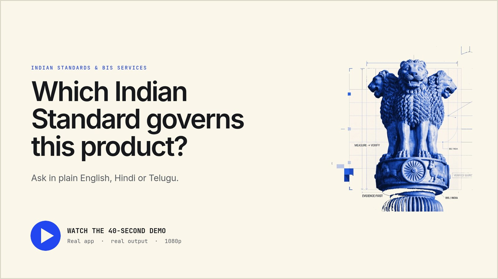
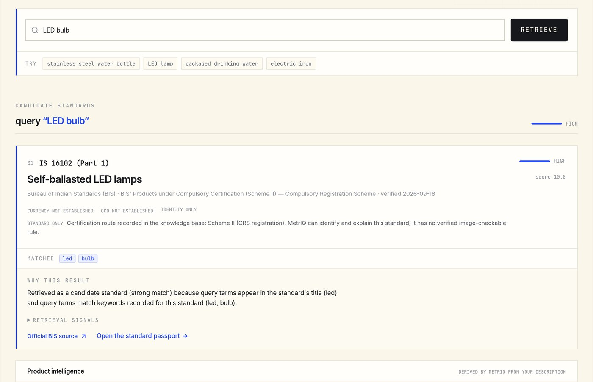
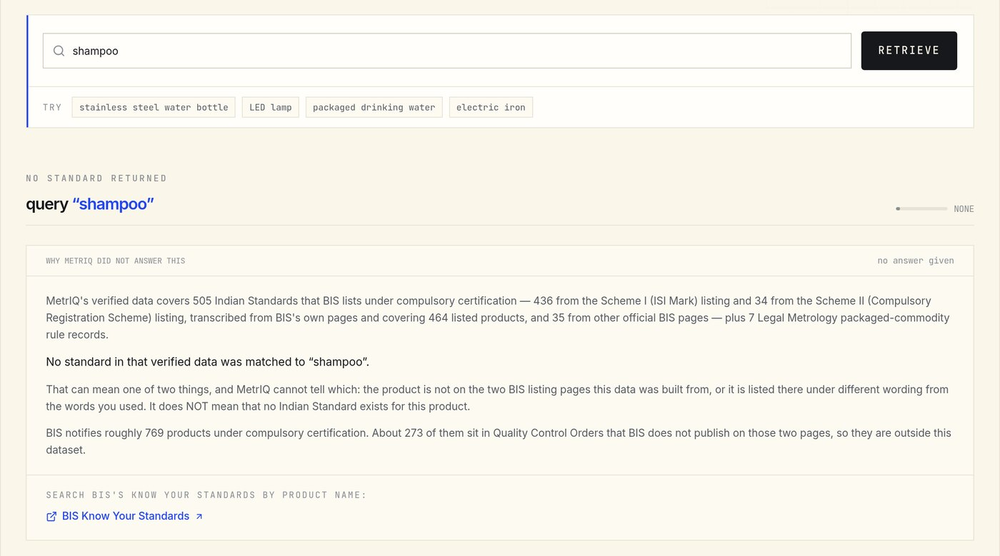
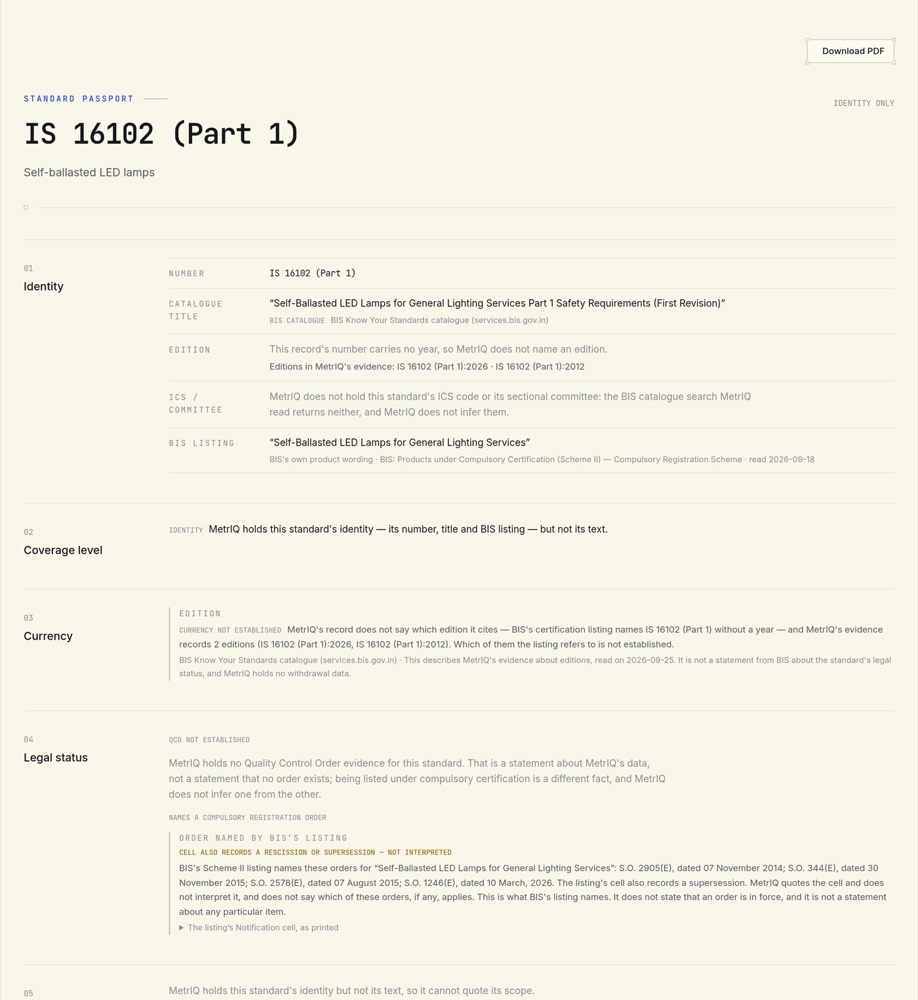
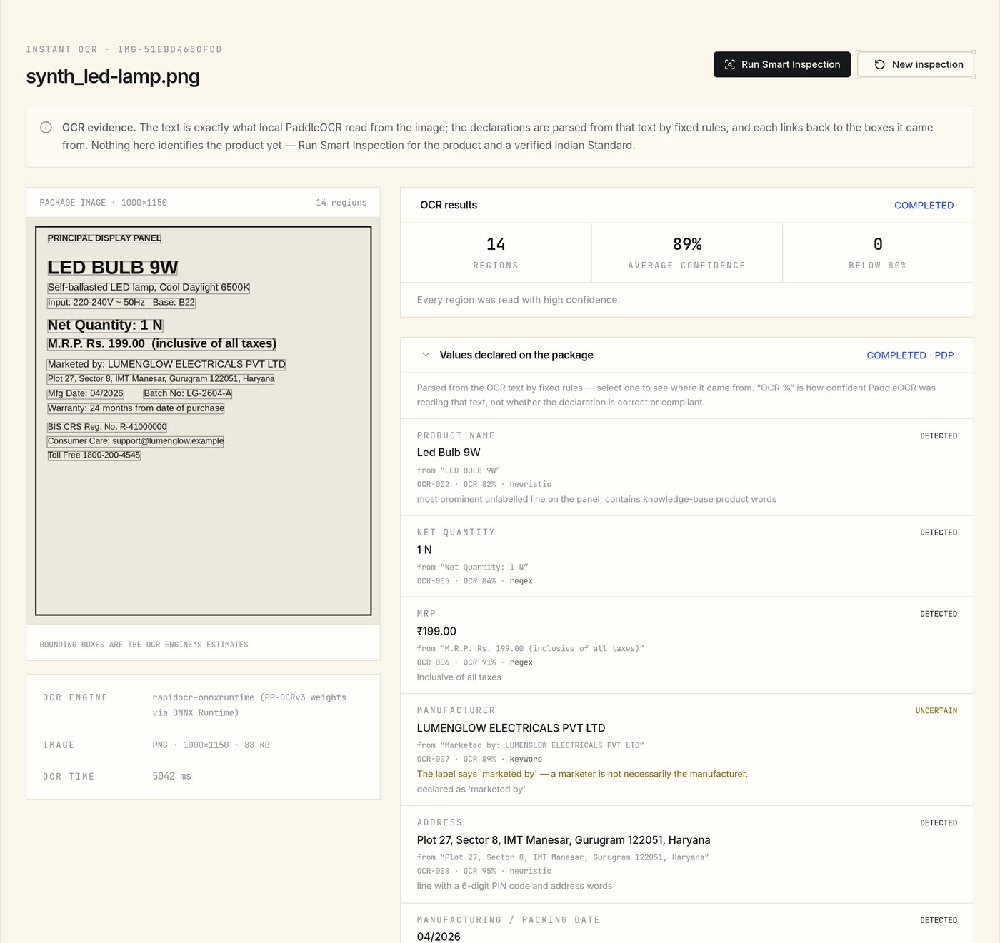
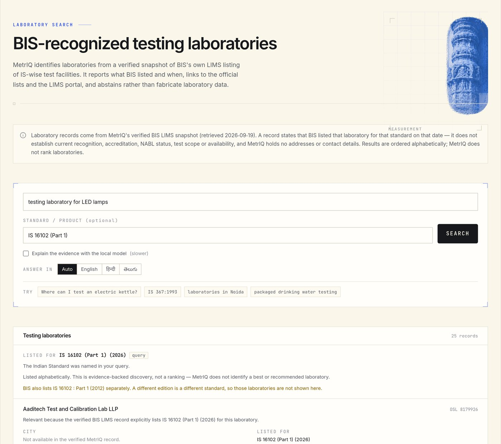
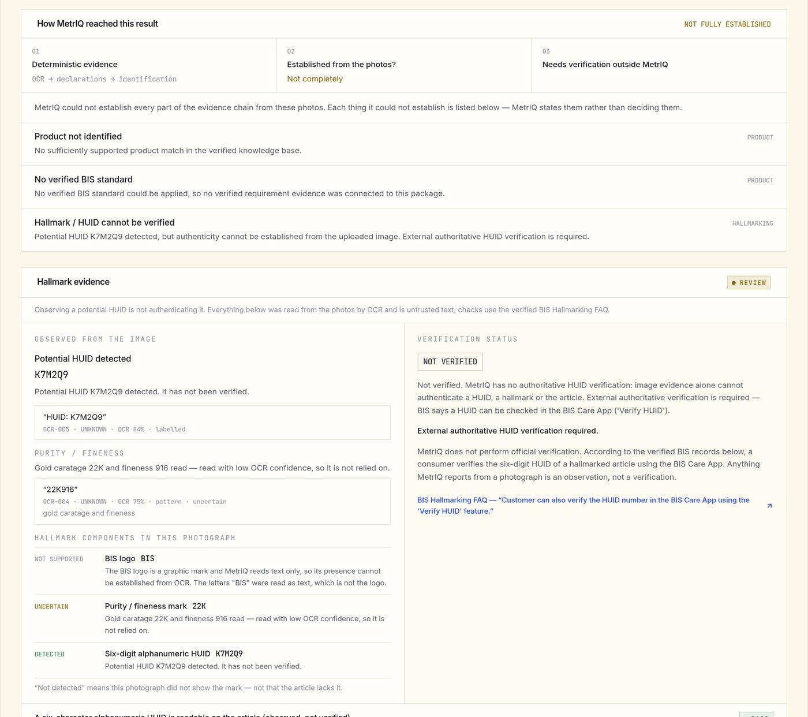
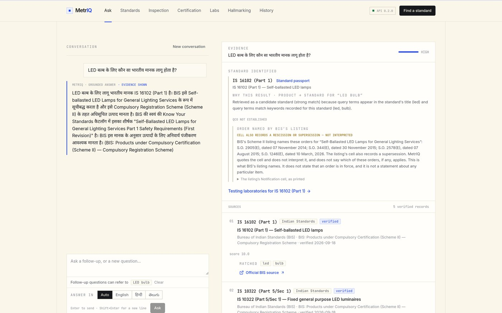
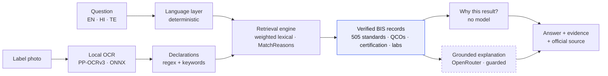

<div align="center">


# MetrIQ

<code>INDIAN STANDARDS · BIS SERVICES · EVIDENCE-BACKED</code>

### Which Indian Standard governs this product?

Ask in plain English, Hindi or Telugu — or photograph the label.<br/>
MetrIQ answers **only from verified BIS records**, shows **why** each result matched,<br/>
and links the **official BIS page** behind every answer.

<br/>


<br/>

<a href="docs/media/metriq-demo.mp4">
  
</a>

<sub>▶ Click to play the 40-second demo — every scene is the real app doing its job.</sub>

</div>

<br/>

<table>
<tr>
<td align="center" width="25%"><h2>505</h2><sub>VERIFIED INDIAN STANDARDS</sub></td>
<td align="center" width="25%"><h2>98.1%</h2><sub>RIGHT STANDARD IN TOP 5</sub></td>
<td align="center" width="25%"><h2>0</h2><sub>INVENTED STANDARD NUMBERS</sub></td>
<td align="center" width="25%"><h2>3</h2><sub>LANGUAGES · EN · हिन्दी · తెలుగు</sub></td>
</tr>
</table>

<sub>Recall@5 over 149 queries derived from BIS's own product ↔ standard pairings
(<code>backend/tests/data/eval_baseline.json</code>). "0 invented" = zero standard numbers outside the
knowledge base across every adversarial and prompt-injection query.</sub>

---

## The one rule

> **Retrieved BIS information is the source of truth — not the language model.**

```
natural language  →  query understanding  →  BIS knowledge retrieval
                  →  evidence ranking     →  grounded explanation
                  →  answer + evidence + official source + next steps
```

Every result is produced by deterministic code. A language model only *explains* what
retrieval already found — it never picks a standard. MetrIQ never invents an Indian
Standard number, a clause, a fee, a test or a compliance outcome, and it gives **no
PASS/FAIL verdict anywhere**. When the evidence is not strong enough, it says so and
abstains.

---

## A tour of the app

<table>
<tr>
<td width="50%" valign="top">
<sub><code>01 · PRODUCT → STANDARD</code></sub><br/>
<b>Describe a product, get its Indian Standard</b><br/>
<sub>"LED bulb" → IS 16102 (Part 1) at HIGH confidence, with the matched words and a plain
"Why this result?" built from the retrieval signals themselves.</sub><br/><br/>

</td>
<td width="50%" valign="top">
<sub><code>02 · HONEST ABSTENTION</code></sub><br/>
<b>No evidence, no answer</b><br/>
<sub>"shampoo" is not on BIS's compulsory-certification lists, so MetrIQ says what its data
covers — and that this does <i>not</i> mean no Indian Standard exists.</sub><br/><br/>

</td>
</tr>
<tr>
<td width="50%" valign="top">
<sub><code>03 · STANDARD PASSPORT</code></sub><br/>
<b>One canonical page per standard</b><br/>
<sub>Identity, edition, currency, legal status, clauses and the certification route —
each line quoting its BIS source. Prints to PDF.</sub><br/><br/>

</td>
<td width="50%" valign="top">
<sub><code>04 · LABEL INSPECTION</code></sub><br/>
<b>Photograph the label instead</b><br/>
<sub>Fully local OCR reads the package; every declared value links back to the exact
box it came from, with its confidence and extraction method.</sub><br/><br/>

</td>
</tr>
<tr>
<td width="50%" valign="top">
<sub><code>05 · TESTING LABORATORIES</code></sub><br/>
<b>Labs BIS itself lists for the standard</b><br/>
<sub>From a dated snapshot of BIS LIMS. Alphabetical, never ranked; validity is stated
"at snapshot", never as current accreditation.</sub><br/><br/>

</td>
<td width="50%" valign="top">
<sub><code>06 · HALLMARKING / HUID</code></sub><br/>
<b>Observed, never authenticated</b><br/>
<sub>Reads a potential HUID and purity mark from a photo and points to the BIS Care App
for real verification. No "verified" state exists in the code.</sub><br/><br/>

</td>
</tr>
</table>

<p align="center">
<sub><code>07 · ASK IN YOUR LANGUAGE</code></sub><br/>
<b>Hindi and Telugu in, the same verified evidence out</b><br/>
<sub>The knowledge base is never translated — standard numbers, schemes and URLs stay exactly as BIS publishes them.</sub><br/><br/>

</p>

---

## How it works


```mermaid
flowchart LR
    Q["Question<br/>EN · HI · TE"] --> L[Language layer<br/>deterministic]
    P["Label photo"] --> O[Local OCR<br/>PP-OCRv3 · ONNX]
    O --> D[Declarations<br/>regex + keywords]
    L --> R[Retrieval engine<br/>weighted lexical · MatchReasons]
    D --> R
    R --> S[Verified BIS records<br/>505 standards · QCOs · certification · labs]
    S --> W[Why this result?<br/>no model]
    S --> E[Grounded explanation<br/>OpenRouter · guarded]
    W --> A[Answer + evidence<br/>+ official source]
    E --> A

    style S fill:#eceffe,stroke:#2246ef,color:#17181b
    style E stroke-dasharray: 4 4
```

| Layer | What it does | Model? |
|---|---|---|
| **Retrieval** (`app/retrieval/`) | Transparent weighted scoring over title / keywords / standard number / content; every point recorded as a `MatchReason` | no |
| **Why this result?** (`app/product.py`) | Built from retrieval's own reasons — never generated | no |
| **Certification journey** (`app/certification_journey.py`) | Every step is a word-for-word quote from a verified record, with its URL | no |
| **Standard Passport** (`/standard/:id`) | Composes identity, currency, QCO status, clauses, route, labs | no |
| **Grounded answer** (`app/rag.py`) | Explains the retrieved records; a guard withholds any invented IS number, HUID, URL, fee or verdict | yes — replaceable |

---

## Quickstart

```bash
# 1 · Backend  (Python 3.11+)
cd backend
python3 -m venv .venv && source .venv/bin/activate
pip install -r requirements.txt
alembic upgrade head                      # needs PostgreSQL, DATABASE_URL default postgresql+psycopg:///metriq
uvicorn app.main:app --port 8000          # http://127.0.0.1:8000/docs

# 2 · Frontend
cd frontend
npm install
npm run dev                               # http://localhost:5173  (proxies /api → :8000)
```

Grounded answers need an OpenRouter key in `backend/.env` (gitignored, server-side only):

```bash
OPENROUTER_API_KEY=sk-or-v1-...
OPENROUTER_MODEL=inclusionai/ling-3.0-flash-vl:free           # copilot
OPENROUTER_GROUNDED_MODEL=inclusionai/ling-3.0-flash-vl:free  # /ask + certification
```

Without a key, everything deterministic still works — retrieval, Why this result,
the certification journey, the Passport, labs and OCR — and `/ask` falls back to
evidence-only text.

<details>
<summary><b>PostgreSQL setup (Arch Linux)</b></summary>

```bash
sudo pacman -S --needed postgresql
sudo -iu postgres initdb -D /var/lib/postgres/data
sudo systemctl enable --now postgresql
sudo -iu postgres createuser -s "$USER"
createdb metriq && createdb metriq_test          # app database + test database
cd backend && ./.venv/bin/alembic upgrade head
```

Only saved inspections need the database; the `/inspections` endpoints return 503 until it is available.
</details>

<details>
<summary><b>Optional: local model (LM Studio) and vision key</b></summary>

LM Studio is used in exactly two places: the inspection pipeline's product-identification
fallback and Laboratory search's `explain=true` path. Load a small instruction model
(default `qwen/qwen3-4b`) and start its server on port `1234`:

```bash
export LM_STUDIO_BASE_URL=http://127.0.0.1:1234/v1
export LM_STUDIO_MODEL=qwen/qwen3-4b
```

Visual product understanding uses its **own** key, so its quota and outages are independent:

```bash
OPENROUTER_VISION_API_KEY=sk-or-v1-...     # NOT the same as OPENROUTER_API_KEY
VISION_MODEL=inclusionai/ling-3.0-flash-vl:free
```

Free-tier guards (`OPENROUTER_DAILY_LIMIT` 45, `OPENROUTER_MINUTE_LIMIT` 15,
`VISION_MAX_IMAGES`, …) refuse a request locally before it reaches the network. A request is
sent only when you press a question — never on page load.
</details>

---

## Tests & checks

```bash
cd backend
./.venv/bin/python -m pytest -q                  # 395 tests (needs the metriq_test database)
./.venv/bin/python scripts/check_knowledge.py    # knowledge-base validation + coverage
./.venv/bin/python scripts/eval_retrieval.py     # offline retrieval eval vs committed baseline
./.venv/bin/python scripts/verify_snapshot.py    # source drift report (never writes the KB)

cd ../frontend
npx tsc --noEmit && npm run build
```

Model-dependent tests use stubs — no live model call is made and no quota is spent.

| Retrieval baseline | |
|---|---:|
| recall@1 | 85.6% |
| recall@5 | 98.1% |
| correct abstention | 24.4% |
| false match | 13.4% |

---

## What's in the knowledge base

<table>
<tr><td><b>505</b></td><td>verified Indian Standards, transcribed from BIS's "Products under Compulsory Certification" (Scheme I / II) with source URL and verification date</td></tr>
<tr><td><b>1,537</b></td><td>OCR'd clause records from 31 standards — <i>citation-only</i>, labelled as unverified OCR text, never used for retrieval</td></tr>
<tr><td><b>29</b></td><td>Quality Control Order rows — status comes from which BIS table a row is in, never from today's date</td></tr>
<tr><td><b>1,205</b></td><td>BIS LIMS laboratory records (245 labs · 83 cities) — 86 of 505 standards have a listed lab</td></tr>
<tr><td><b>70</b></td><td>certification, FAQ, hallmarking, Legal Metrology, consumer and general BIS records</td></tr>
</table>

This is a focused, curated dataset — **not** complete BIS coverage. About 273 of the ~769
products notified under compulsory certification sit in Quality Control Orders outside
the two BIS listing pages, and MetrIQ does not guess them.

---

## Deep dive

<details>
<summary><b>API endpoints</b></summary>

| Endpoint | What it does | Model |
|---|---|---|
| `GET /health` | liveness | — |
| `GET`/`POST /search` | deterministic lexical retrieval over the BIS knowledge base | no |
| `POST /product-standard` | Product → candidate Indian Standard + "Why this result?" | no |
| `POST /ask` | grounded BIS Q&A in English / Hindi / Telugu (also serves Hallmarking) | OpenRouter |
| `POST /certification-guidance` | certification journey + optional grounded explanation (`explain=false` skips it) | OpenRouter, optional |
| `POST /laboratory-search` | laboratories for a standard or product | LM Studio, optional |
| `GET /standard-passport/{record_id}` · `/standard-passport/lookup` | the Standard Passport for one standard (a number without a year lists every held edition) | no |
| `POST /product-context` | one server-derived context across all features | no |
| `POST /evidence-graph` | read-only graph of relationships already established | no |
| `POST /inspection/ocr` · `/inspection/analyze` | label photo(s) → OCR → declarations → product → standard | LM Studio fallback only |
| `POST /inspections` · `GET /inspections[/{id}]` | save / list / read immutable inspection records | no |
| `GET /inspections/{id}/report.pdf` | evidence-backed PDF built from the stored record | no |
| `POST /copilot/explain` | grounded explanation of a finished result | OpenRouter |

</details>

<details>
<summary><b>Label inspection pipeline</b></summary>

```
IMAGE → OCR REGION → DECLARATION → PRODUCT CLUE → PRODUCT     → STANDARD CANDIDATE → BIS SOURCE
       (id, bbox,    (field, value, (text + its   (KB product   (IS 16102 (Part 1),   (verified
        confidence)   status)        OCR regions)  description)  why this result)      record)
```

One package is a single photo (`image`, optional `side`) or several photos of the same
package (`images` + `sides` = FRONT / BACK / LEFT / RIGHT / TOP / BOTTOM / UNKNOWN). Each
photo is OCR'd separately and every value keeps the photo and region it came from; a photo
that cannot be read is reported as failed, and unphotographed sides as not uploaded — never
as missing.

Products and standards come only from `data/knowledge/` through the same retrieval engine as
Product → Standard. A product match needs a product phrase of that record on the label; an
IS number printed on the label is one more signal, never proof on its own. Anything weaker is
`REVIEW`, with the reason. Declarations are `DETECTED` / `UNCERTAIN` / `NOT_DETECTED` in the
uploaded photos — never "legally missing".

`app/escalation.py` then states, deterministically, every point of the evidence chain the
photos could not establish (unreadable photo, product not identified, several candidates, no
verified standard, HUID, conflicting sides, …). It changes no result and produces no verdict.

Saved inspections are stored in PostgreSQL with their photos and are **immutable** — a
database trigger rejects any update. History, a dashboard and a PDF report all read the
stored record; nothing is recomputed.

```bash
curl -s -F "image=@samples/ocr-labels/synth_led-lamp.png" \
  http://127.0.0.1:8000/inspection/analyze | jq '.product, [.standards[].standard_number]'
```

| Sample (`samples/ocr-labels/`) | Identified as | Standard candidate |
|---|---|---|
| `synth_clean-declaration.png` | Roasted Bengal Gram | IS 18140:2023 |
| `synth_led-lamp.png` | Self-ballasted LED lamps | IS 16102 (Part 1) |
| `synth_electric-kettle.png` | Electric Kettles and Jugs | IS 367:1993 |
| `real_*` (Wikimedia Commons) | real-world labels, incl. hard cases | OCR stress tests |

</details>

<details>
<summary><b>Hallmarking & HUID — observed, never authenticated</b></summary>

MetrIQ can identify and explain observable hallmark/HUID evidence, but it does not
authenticate a physical jewellery item's hallmark, HUID, jeweller registration or AHC status.

- `verification_status` is only `NOT_VERIFIED` or `NOT_DETECTED`; there is no AUTHENTIC,
  VERIFIED or CERTIFIED state anywhere in the code.
- The three BIS marks — BIS logo, purity/fineness, HUID — are each `DETECTED` /
  `NOT_DETECTED` / `UNCERTAIN` / `NOT_SUPPORTED`. The BIS logo is always `NOT_SUPPORTED`: it
  is a graphic and OCR reads text.
- "Not detected" is about the photograph, never a finding that the article lacks the mark.
- Printed text like "HUID VERIFIED" is recorded as an untrusted claim and changes nothing.
- A HUID the user types is compared with the OCR text as a string only.
- Real verification is pointed to the BIS Care App, quoted from verified BIS records.

</details>

<details>
<summary><b>Testing laboratories</b></summary>

MetrIQ identifies laboratories from verified laboratory evidence. It does not independently
establish a laboratory's current accreditation, scope, availability or operational status.

Search by standard, by a question naming a standard, or by product (which reuses
Product → Standard: *"Where can I test an electric kettle?"* → IS 367:1993 → the labs BIS LIMS
lists for it). A lab is relevant **only because BIS lists it** against that standard. Each
result carries a deterministic why (`STANDARD_LISTED`, `PRODUCT_LISTED`, `NAME_MATCH`,
`CITY_MATCH`), results are alphabetical, and validity is `VALID_AT_SNAPSHOT` /
`EXPIRED_AT_SNAPSHOT` / `NOT_STATED`. A different edition is a different standard, so
IS 14543 (2016) and (2024) labs are never merged. Addresses, phones, emails and NABL status
are not held and never supplied.

The snapshot (`data/laboratories.json`, retrieved 2026-09-19) is built by
`backend/scripts/fetch_lims_laboratories.py`; the app never calls LIMS at runtime.

</details>

<details>
<summary><b>Multilingual — English · Hindi · Telugu</b></summary>

The language of interaction changes, the source of truth does not.

```
query (any language) → script detection (no model) → known terms rewritten to canonical English
                     → the SAME retrieval engine → the SAME verified records
                     → grounded answer written in the user's language
```

`/ask`, `/certification-guidance` and `/laboratory-search` take `language` = `auto` / `en` /
`hi` / `te`. The alias table (`app/language.py`) only maps spellings of products and BIS terms
that exist in the knowledge base. Standard numbers, scheme names, document names and URLs are
reproduced exactly, never translated. If retrieval finds nothing, the assistant abstains in the
user's language. Hinglish / Tanglish work.

</details>

<details>
<summary><b>Certification journey</b></summary>

`POST /certification-guidance` answers *"what certification process do I follow?"*. Nothing in
the journey is written by MetrIQ — each step is a word-for-word quote from a verified record
with its official URL. The scheme is read two independent ways (the BIS listing the standard
was transcribed from, and any certification record naming it); if they disagree, the conflict
is shown and MetrIQ picks neither.

| Status | Meaning |
|---|---|
| `VERIFIED` | one standard, a route established, every documented step present |
| `PARTIAL` | several candidates, a conflict, missing steps, or hallmarking |
| `INSUFFICIENT` | no verified record states a route |

It is guidance about the route for a product type — never a statement that a product or
licence is certified. Fees, processing times and required documents are never stated; they
live only in the BIS documents it links to.

</details>

<details>
<summary><b>Copilot, product context & evidence graph</b></summary>

**Copilot** — explains evidence the deterministic system produced; it never establishes
standards, compliance, lab status, certification applicability or HUID authenticity. After the
model replies, a deterministic guard replaces the text with MetrIQ's own sentence if it cites an
IS number, HUID or URL not in the context, claims authentication, states any PASS/FAIL or
"compliant" verdict, ranks or vouches for a laboratory, or states a fee not in the evidence. The
key stays on the server — there is no `VITE_` variable for it.

**Product context** (`app/product_context.py`) — connects what each feature already
established into one view, with each feature `AVAILABLE` / `NOT_AVAILABLE` / `NOT_APPLICABLE` /
`UNCERTAIN`. It is a composition: no classifier, no ranking, no model. Conflicts are shown,
never resolved.

**Evidence graph** (`app/evidence_graph.py`) — a read-only projection of relationships already
established (OCR region → declaration → product → standard → requirement / certification /
laboratory / source). 11 node types, 8 edge types, each edge carrying an explanation taken from
the evidence. No model, no retrieval, no verdict vocabulary; nothing downstream reads it.

</details>

<details>
<summary><b>Retrieval scoring reference</b></summary>

Each query term is matched against a record's fields and the weights are summed
(`RetrievalConfig` in `app/retrieval/engine.py`): standard-number match `8` (`12` if the year
also matches), title `4`, keyword `3`, category hint `2`, document name `1.5`, reference `1`,
content mention `1`.

**Confidence** of the top hit: `high` ≥ 7.5, `medium` ≥ 4.0, `low` ≥ 1.0, else `none`. If the
top hit covers less than ~⅓ of the query terms, confidence is capped at `low`. When nothing
matches: `confidence: "none"`, `abstained: true`, empty `results`.

Inspection product identification keeps a result only when the label contains a multi-word
product phrase of the record, so a single generic word ("water", "gram") can never pull in a
standard.

</details>

<details>
<summary><b>Repository layout</b></summary>

```
backend/            Python · FastAPI
  app/              retrieval/, rag.py, product.py, certification*.py, laboratory.py, lab_registry.py,
                    language.py, clauses.py, clause_groups.py, standard_currency.py, boundary.py,
                    ocr.py, declarations.py, pipeline.py, hallmark.py, copilot.py, openrouter.py, …
  migrations/       Alembic (PostgreSQL)
  scripts/          check_knowledge, eval_retrieval, verify_snapshot, build-time fetch_* tools
  tests/            plain-Python runners, bridged to pytest
data/knowledge/     the knowledge base — one JSON file per category
data/laboratories.json   BIS LIMS snapshot
samples/ocr-labels/ sample label images
frontend/           React 19 · TypeScript · Vite · Tailwind v4
docs/history/       phase-by-phase design decisions
```

</details>

---

<div align="center">

<sub><code>BUILT FOR SMART INDIA HACKATHON · PROBLEM STATEMENT SIH26107</code></sub><br/>
<sub>MetrIQ is a research prototype. It is not affiliated with or endorsed by the Bureau of Indian Standards,
and it does not make legal or compliance determinations.<br/>Always confirm against the official BIS source it links.</sub>

</div>
